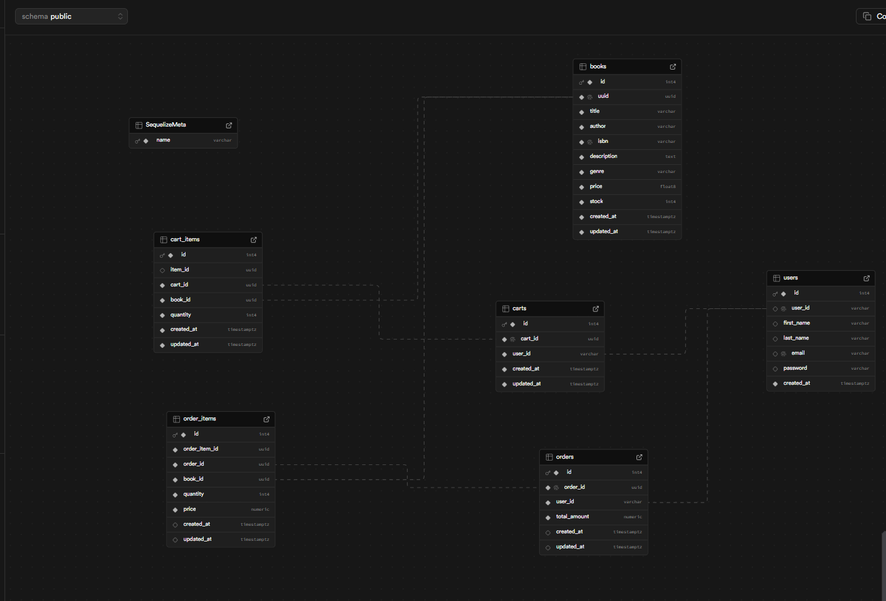

# Bookstore API

A RESTful API for an online bookstore built with Node.js, Express, TypeScript, and PostgreSQL. This API provides functionality for user authentication, book management, shopping cart operations, and order processing.

## Features

- User authentication (register/login)
- Book catalog management
- Shopping cart functionality
- Order processing
- Swagger API documentation

## Tech Stack

- Node.js
- Express.js
- TypeScript
- PostgreSQL
- Sequelize ORM
- JWT for authentication
- Swagger for API documentation

## Project Structure

```
src/
├── api/                    # API layer
│   ├── middlewares/       # Express middlewares
│   ├── requestHandlers/   # Request handlers
│   └── routers/          # Route definitions
├── core/                  # Core application code
│   ├── configs/          # Configuration files
│   ├── controllers/      # Business logic
│   ├── database/         # Database setup and migrations
│   ├── interfaces/       # TypeScript interfaces
│   ├── models/           # Sequelize models
│   ├── services/         # Service layer
│   └── utils/            # Utility functions
├── __tests__/            # Test files
│   └── controllers/      # Controller tests
├── app.ts                # Express app setup
└── server.ts             # Server entry point
```

## Database Schema

### Users Table

- id: Primary Key
- user_id: UUID
- first_name: String
- last_name: String
- email: String (unique)
- password: String (hashed)
- created_at: Timestamp

### Books Table

- id: Primary Key
- uuid: UUID
- title: String
- author: String
- isbn: String
- description: Text
- genre: String
- price: Decimal
- stock: Integer
- created_at: Timestamp
- updated_at: Timestamp

### Carts Table

- id: Primary Key
- cart_id: UUID
- user_id: UUID (Foreign Key)
- created_at: Timestamp
- updated_at: Timestamp

### Cart Items Table

- id: Primary Key
- item_id: UUID
- cart_id: UUID (Foreign Key)
- book_id: UUID (Foreign Key)
- quantity: Integer
- created_at: Timestamp
- updated_at: Timestamp

### Orders Table

- id: Primary Key
- order_id: UUID
- user_id: UUID (Foreign Key)
- total_amount: Decimal
- created_at: Timestamp
- updated_at: Timestamp

### Order Items Table

- id: Primary Key
- order_item_id: UUID
- order_id: UUID (Foreign Key)
- book_id: UUID (Foreign Key)
- quantity: Integer
- price: Decimal
- created_at: Timestamp
- updated_at: Timestamp

The schema diagram from supabase



## API Endpoints

### Authentication

- POST `/api/auth/register` - Register a new user
- POST `/api/auth/login` - Login user

### Books

- GET `/api/books` - Get all books
- GET `/api/books/:id` - Get book by ID

### Cart

- GET `/api/cart` - Get user's cart
- POST `/api/cart/add` - Add item to cart
- DELETE `/api/cart/clear` - Clear cart

### Orders

- POST `/api/orders/checkout` - Create order from cart
- GET `/api/orders/history` - Get user's order history
- GET `/api/orders/:orderId` - Get order details

## Getting Started

### Prerequisites

- Node.js (v16 or higher)
- PostgreSQL
- npm or yarn

### Installation

see the [Get STarted](./GETTING_STARTED.md) on how to setup

## API Documentation

The API is documented using Swagger/OpenAPI. When the server is running, you can access the interactive documentation at:

```
http://localhost:PORT/api-docs
```

The Swagger documentation provides:

- Detailed endpoint descriptions
- Request/response schemas
- Authentication requirements
- Try-it-out functionality

## Error Handling

The API uses standard HTTP status codes:

- 200: Success
- 201: Created
- 400: Bad Request
- 401: Unauthorized
- 404: Not Found
- 500: Internal Server Error

All responses follow this format:

```json
{
  "status": "false",
  "data": {},
  "message": "Error fetching error"
}
```

## Authentication

The API uses http only cookies for authorization. Learn more about them [here](https://developer.mozilla.org/en-US/docs/Web/HTTP/Guides/Cookies)

## Development

### Available Scripts

- `npm run dev` - Start development server with hot-reload
- `npm run build` - Build the project
- `npm start` - Start production server
- `npm run lint` - Run ESLint
- `npm test` - Run tests

## Contributing

1. Fork the repository
2. Create your feature branch (`git checkout -b feature/amazing-feature`)
3. Commit your changes (`git commit -m 'Add some amazing feature'`)
4. Push to the branch (`git push origin feature/amazing-feature`)
5. Open a Pull Request

## License

This project is licensed under the GNU APGL License - see the [LICENSE](LICENSE) file for details.
